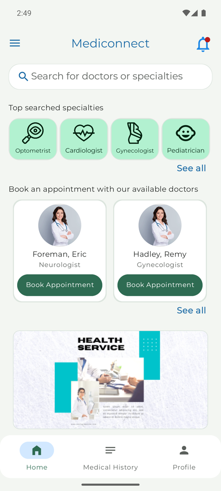
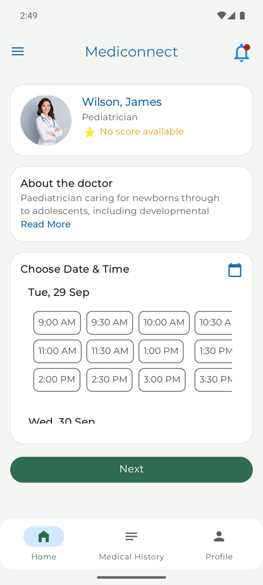
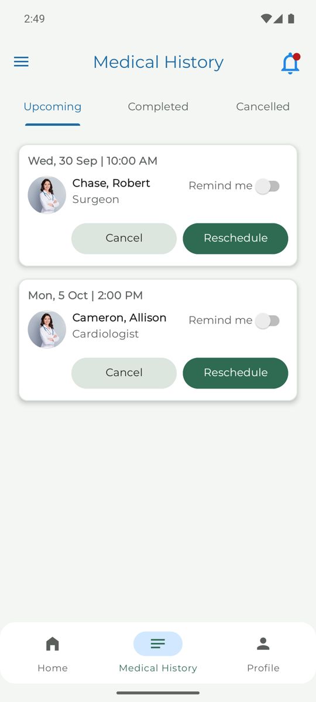
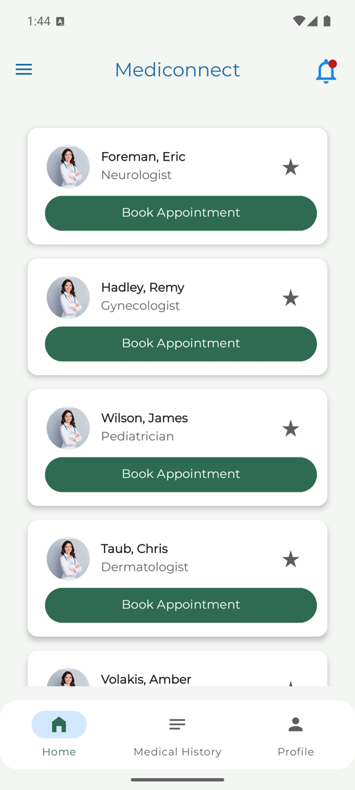
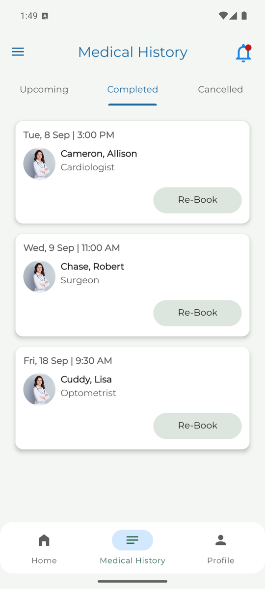
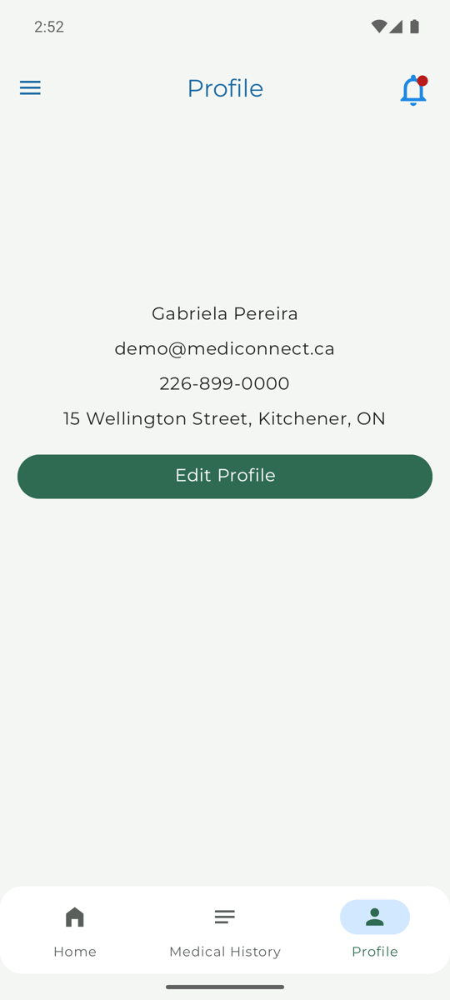
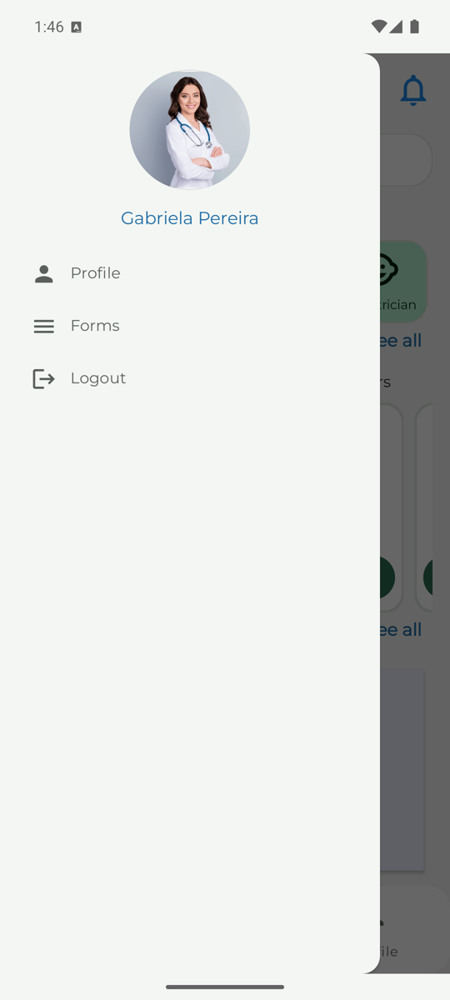
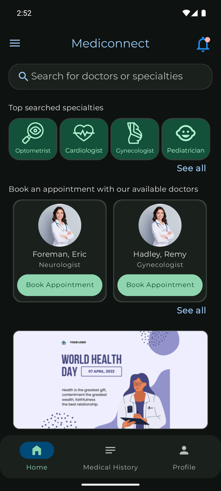

<div align="center">

# MediConnect

**A patient management system for healthcare clinics — Android app, REST API and clinic back office.**

Appointment booking, medical history, pre-appointment forms and notifications,
backed by a Spring Boot service with a Thymeleaf admin panel.

[Features](#features) · [Screenshots](#screenshots) · [Run it locally](#run-it-locally) · [API](#api-reference) · [Architecture](#architecture)

</div>

---

<div align="center">
  
  
  
</div>

## What this is

MediConnect has three parts, all in this repository:

| Part | What it does |
|---|---|
| **`android/`** | The patient app — browse doctors, book slots, manage appointments, fill in forms |
| **`backend/` → `mobile/`** | The REST API the app talks to |
| **`backend/` → `backoffice/`** | A server-rendered admin panel for clinic staff to manage doctors, patients, schedules and notifications |

It started as a postgraduate project for the Mobile Solutions program at
Conestoga College and has since been rebuilt as a portfolio piece.

## Features

**Patient app**
- Browse doctors by specialty, with ratings drawn from completed visits
- Book an appointment against a real schedule of free slots
- Upcoming, completed and cancelled appointments, with reschedule and cancel
- Leave a review after a visit
- Pre-appointment and check-in forms
- Clinic notifications with an unread badge
- A health record of allergies, medications and conditions, kept once
  instead of rewritten on paper at every visit
- Export a health summary in the pan-Canadian standard, to hand to another
  clinic
- Join a waitlist and be told when an earlier appointment frees up
- Light, dark or follow-the-system, chosen in the app
- Pull down on any list to re-fetch
- Passwordless sign-in by one-time passcode

**Clinic back office** (`http://localhost:8080`)
- CRUD for doctors, patients, appointments, schedules and notifications
- A cancelled appointment puts its slot back on sale and tells everyone on
  that doctor's waitlist who could use it
- Doctor photo upload
- Built with Thymeleaf, Bootstrap and htmx

**Throughout**
- Light and dark themes from a single set of role-named colour tokens
- Every fetching screen has a loading skeleton, an empty state that offers a
  way forward, and an error state with a retry — a failed request no longer
  looks like an empty account
- Material 3 components: outlined text fields with floating labels, cards,
  a spacing scale and a type scale
- Screen transitions and staggered list entry
- Works offline: if the API is unreachable the app shows a bundled demo clinic
  rather than empty screens, so an installed APK is browsable on its own
- Every network call runs off the UI thread
- OpenAPI docs at `/swagger-ui.html`

## Screenshots

| Doctors | Booking | Upcoming |
|---|---|---|
|  |  |  |

| History | Profile | Menu |
|---|---|---|
|  |  |  |

<div align="center">
  <br>
  <strong>Dark mode</strong><br>
  
</div>

## Tech stack

| | |
|---|---|
| **App** | Java, Android SDK (min 26, target 34), Material 3, ViewBinding, OkHttp, Gson, Glide |
| **API** | Java 17, Spring Boot 3.3, Spring Data JPA, springdoc-openapi |
| **Back office** | Thymeleaf, Bootstrap 5, htmx |
| **Database** | H2 in-memory by default, PostgreSQL for real use |
| **Build** | Gradle (both halves), GitHub Actions |

## Run it locally

**Requirements:** JDK 17 or newer. Android Studio only if you want to run the app.

```bash
git clone https://github.com/gabrielapereira15/Mediconnect.git
cd Mediconnect
```

### 1. Start the backend

```bash
cd backend
./gradlew bootRun
```

That is the whole setup. It runs on an **in-memory H2 database** and seeds
itself with a small clinic on first start — 8 doctors, weekday slot grids three
weeks either side of today, a patient with appointments in every state, plus
reviews and notifications.

| What | Where |
|---|---|
| Clinic back office | http://localhost:8080 |
| API docs (Swagger) | http://localhost:8080/swagger-ui.html |
| Database console | http://localhost:8080/h2-console |

Check it is up:

```bash
curl http://localhost:8080/api/mobile/doctors
```

<details>
<summary><strong>Using PostgreSQL instead</strong></summary>

The default H2 database is wiped on every restart. For one that persists:

```bash
cd backend
docker compose up -d        # starts Postgres 17 on :5432
./gradlew bootRun --args='--spring.profiles.active=postgres'
```

Or point it at any Postgres you already have:

```bash
JDBC_DATABASE_URL=jdbc:postgresql://localhost:5432/mediconnect \
JDBC_DATABASE_USERNAME=me JDBC_DATABASE_PASSWORD=secret \
./gradlew bootRun --args='--spring.profiles.active=postgres'
```

</details>

### 2. Run the app

Open `android/` in Android Studio and press Run — it will create an emulator
if you have none, and write the `local.properties` it needs.

To build from the command line instead, tell Gradle where your Android SDK is:

```bash
cd android
echo "sdk.dir=/path/to/Android/Sdk" > local.properties   # macOS/Linux
# Windows: sdk.dir=C:/Users/you/AppData/Local/Android/Sdk

./gradlew assembleDebug
adb install -r app/build/outputs/apk/debug/app-debug.apk
```

`local.properties` is machine-specific and git-ignored, which is why it is not
in the repository.

The app points at `http://10.0.2.2:8080` — the emulator's route to your
machine's localhost. To use a different server:

```bash
./gradlew assembleDebug -PapiBaseUrl=https://api.example.com
```

> **Without the backend running**, the app falls back to a bundled demo clinic
> and shows a notice saying so. Browsing works; signing in does not, since
> that needs the API.

### 3. Sign in

Sign-in is by one-time passcode. There is no mail provider wired up, so in
development the passcode is **returned in the API response and printed to the
backend log**:

```
Passcode for demo@mediconnect.ca is 418223 (valid 10 minutes)
```

Use the seeded patient — **`demo@mediconnect.ca`** — which already has
appointments, reviews and notifications. Any other email works too and creates
a fresh patient record.

> The production profile turns this off, so a real deployment never exposes a
> passcode.

### What to try

Once you are signed in as `demo@mediconnect.ca`:

- **Home** — browse doctors and specialties; the ratings come from real
  reviews on completed visits
- **Book Appointment** — pick a doctor, then a date and slot from their actual
  schedule. Slots already taken are not offered.
- **Medical History** — Upcoming, Completed and Cancelled tabs. **Pull down**
  on any of them to re-fetch. Cancel an appointment and watch it move tabs.
- **Leave a review** — on a completed visit, then see the doctor's rating
  change on Home
- **Profile** — edit and save; the email is deliberately read-only
- **Empty states** — cancel every upcoming appointment to see the empty tab
  and its "Book an appointment" shortcut
- **Dark mode** — switch your device theme; the whole app follows
- **Offline** — stop the backend and reopen the app. It shows the bundled demo
  clinic with a notice, rather than empty screens.
- **Back office** — http://localhost:8080 in a browser, to add a doctor or
  send a notification and see it appear in the app

### Commands

| Directory | Command | Does |
|---|---|---|
| `backend` | `./gradlew bootRun` | Start the API and back office |
| `backend` | `./gradlew build` | Compile and run the tests |
| `backend` | `./gradlew test` | Tests only |
| `android` | `./gradlew assembleDebug` | Build the APK |
| `android` | `./gradlew testDebugUnitTest` | Unit tests |
| `android` | `./gradlew lintDebug` | Android lint |

### Configuration

| Variable | Default | Purpose |
|---|---|---|
| `JDBC_DATABASE_URL` | in-memory H2 | Database connection |
| `TOKEN_SECRET` | dev value | Token signing key — **required** in production |
| `DEMO_DATA_ENABLED` | `true` | Seed an empty database |
| `EXPOSE_OTP` | `true` | Return the passcode in the response |
| `PHOTO_BASEURL` | `http://localhost:8080` | Where doctor photos are served from |

### Troubleshooting

| Symptom | Fix |
|---|---|
| App shows demo data with the server running | The emulator reaches your machine at `10.0.2.2`, not `localhost`. Rebuild with the right `-PapiBaseUrl` if you changed it. |
| `CLEARTEXT communication not permitted` | Only debug builds allow plain HTTP, and only to local hosts. Use a debug build, or serve over HTTPS. |
| 401 on appointments after restarting the backend | The session token outlived the server. Sign in again. |
| `Could not resolve placeholder 'TOKEN_SECRET'` | You started the `production` profile without setting it. That is deliberate. |
| `SDK location not found` when building from the terminal | Create `android/local.properties` with `sdk.dir=...`, as above. |
| App says the server is unreachable, but `curl` works from your machine | The emulator's own network can get stuck, usually after throttling it. Check with `adb shell ping 10.0.2.2`; if that fails, cold-boot the emulator (**Wipe Data** in Device Manager). |

## Tests

```bash
cd backend && ./gradlew test                # 12 tests
cd android && ./gradlew testDebugUnitTest   # 10 tests
```

The backend tests cover the two things that decide whether a patient's records
are reachable: whether a passcode can be guessed (replay, brute-force burnout,
expiry) and whether a token can be forged (wrong secret, tampered payload,
signature swapped from another account).

The app tests cover the demo catalogue — the thing an installed APK shows when
no server is running — and the model setters.

## API reference

Base URL `http://localhost:8080`. Full schema at `/swagger-ui.html`.

### Auth

| Method | Route | Description |
|---|---|---|
| `POST` | `/auth/get-otp` | Send a passcode to an email |
| `POST` | `/auth/verify-otp` | Exchange a passcode for a bearer token |

```bash
curl -X POST http://localhost:8080/auth/get-otp \
  -H "Content-Type: application/json" \
  -d '{"email":"demo@mediconnect.ca","role":"patient"}'
```

### Mobile

Everything below the doctor directory requires `Authorization: Bearer <token>`,
and the email in the URL must be the token's own.

| Method | Route | Auth |
|---|---|---|
| `GET` | `/api/mobile/doctors` | public |
| `GET` | `/api/mobile/doctors/{id}` | public |
| `GET` | `/api/mobile/patients/{email}` | required |
| `POST` | `/api/mobile/patients` | required |
| `PUT` | `/api/mobile/patients/{id}` | required |
| `GET` | `/api/mobile/appointments/{email}` | required |
| `POST` | `/api/mobile/appointments` | required |
| `PUT` | `/api/mobile/appointments/cancel/{id}` | required |
| `GET` | `/api/mobile/notifications/{email}` | required |
| `POST` | `/api/mobile/notifications/ack/{id}` | required |
| `POST` | `/api/mobile/reviews` | required |
| `GET` | `/api/mobile/health/{email}` | required |
| `POST` | `/api/mobile/health/{email}` | required |
| `POST` | `/api/mobile/health/{email}/{id}/stop` | required |
| `GET` | `/api/mobile/waitlist/{email}` | required |
| `POST` | `/api/mobile/waitlist/{email}` | required |
| `POST` | `/api/mobile/waitlist/{email}/{id}/leave` | required |

### FHIR

A read-only view of the same data, shaped by HL7 FHIR R4 rather than by the
app's screens, so another Canadian system can read it. Patient,
Practitioner, PractitionerRole, Organization and Appointment carry **CA
Core+** profiles (and CA Baseline where it also applies); `$summary`
returns a pan-Canadian Patient Summary (**PS-CA**) document.

| Method | Route | Auth |
|---|---|---|
| `GET` | `/fhir/metadata` | public |
| `GET` | `/fhir/Practitioner`, `/fhir/PractitionerRole` | public |
| `GET` | `/fhir/Schedule`, `/fhir/Slot?status=free` | public |
| `GET` | `/fhir/Patient/{id}` | required |
| `GET` | `/fhir/Patient/{id}/$summary` | required |
| `GET` | `/fhir/Appointment?patient={id}` | required |

What is verified and what is not — including why scheduling claims no
Canadian profile — is in **[docs/FHIR.md](docs/FHIR.md)**.

## Architecture

```
android/
└─ app/src/main/java/…/mediconnect_android/
   ├─ activity/     Splash, Welcome, OTP, Main
   ├─ fragment/     one per screen
   ├─ adapter/      RecyclerView adapters
   ├─ client/       API clients — ApiConfig holds the base URL and token
   ├─ data/         bundled demo clinic, used when the API is unreachable
   ├─ model/        response models
   └─ util/         Background (threading), SessionManager, dialogs

backend/src/main/java/com/vegs/mediconnect/
├─ auth/            OTP issue/verify, HMAC tokens, request interceptor
├─ mobile/          the REST API the app consumes
├─ backoffice/      Thymeleaf admin panel
├─ datasource/      JPA entities and repositories
├─ demo/            seeds an empty database
└─ config/          JPA, Jackson, Swagger
```

**A few decisions worth noting**

- **No Spring Security.** The back office shares this application and is an
  internal tool with its own story; adding a filter chain to protect the phone
  endpoints would have locked it down as a side effect. Instead a single
  interceptor guards the mobile routes and checks that the email in the URL
  matches the token — a token proves who you are, it must not let you read
  someone else.
- **The app never blocks the UI thread.** Every client call goes through
  `Background`, which is why a slow or missing server degrades instead of
  freezing the app.
- **Colours are named by role, not appearance.** `md_on_surface`, not
  `dark_gray`. That is what makes a dark palette expressible; the old names are
  kept as aliases so existing layouts pick up both themes unchanged.
- **H2 by default, Postgres by profile.** A clone should run with one command
  and no database install.

## Credits

Originally built for the Mobile Solutions postgraduate
program at Conestoga College, then rebuilt as a portfolio piece.

Fonts from [Google Fonts](https://fonts.google.com/specimen/Montserrat).

## Licence

[MIT](LICENSE) © Gabriela Nascimento Oliveira Pereira
