<div align="center">

# MediConnect

**A patient management system for healthcare clinics — Android app, REST API and clinic back office.**

Booking, visits, pre-appointment forms, clinic messages, a waitlist for earlier
slots and a portable health record, backed by a Spring Boot service with a
server-rendered back office for clinic staff.

[Features](#features) · [Screenshots](#screenshots) · [Run it locally](#run-it-locally) · [API](#api-reference) · [Architecture](#architecture)

</div>

---

<div align="center">
  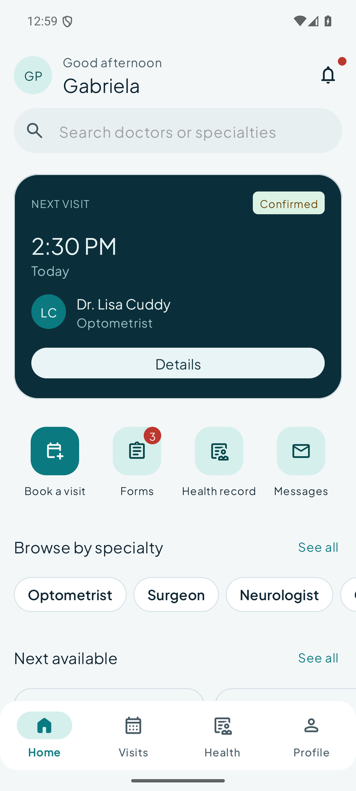
  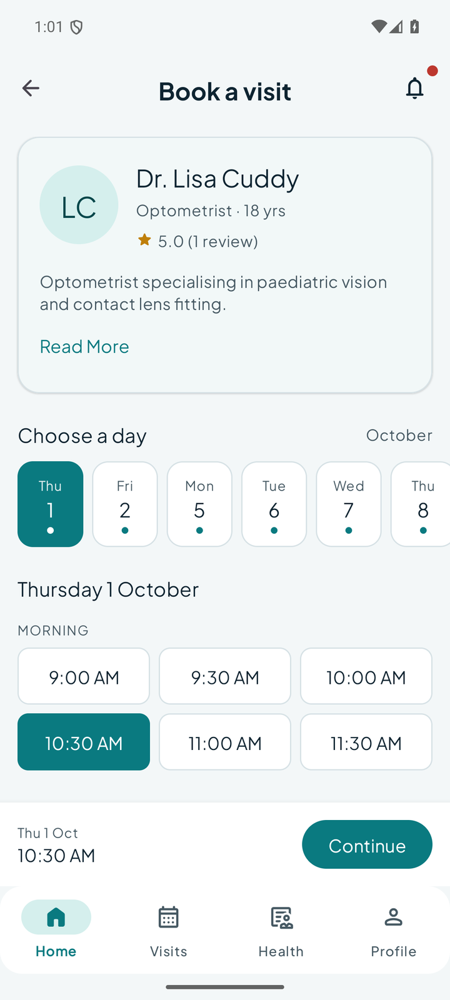
  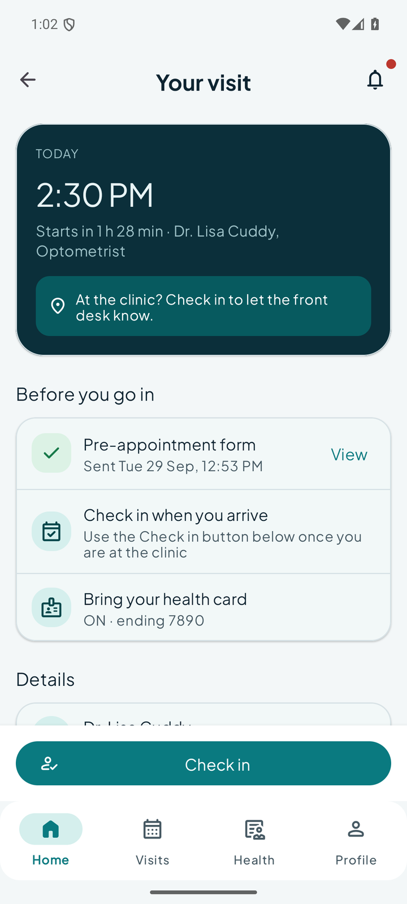
  <br><br>
  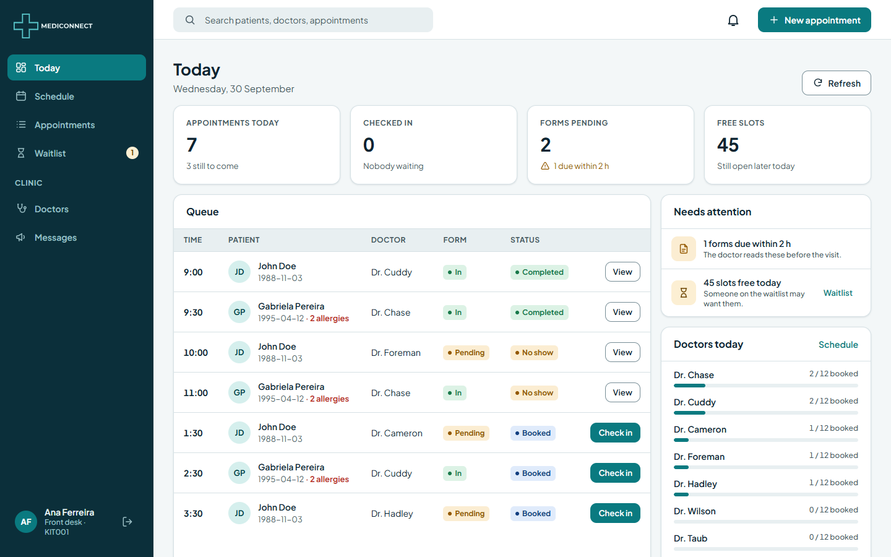
</div>

## What this is

MediConnect lives in this one repository:

| Part | What it does |
|---|---|
| **`android/`** | The patient app — find a doctor, book and manage visits, fill in pre-visit forms, read clinic messages, keep a health record |
| **`backend/` → `mobile/`** | The REST API the app talks to |
| **`backend/` → `backoffice/`** | A server-rendered back office where the front desk and clinicians run the clinic's day, behind a staff sign-in |
| **`backend/` → `fhir/`** | A read-only HL7 FHIR R4 view of the same data, with Canadian profiles |

It started as a postgraduate project for the Mobile Solutions program at
Conestoga College and has since been rebuilt as a portfolio piece.

## Features

**Patient app**
- Find a doctor by name or specialty, narrow to those available today, and sort
  by soonest, rating or name. Ratings come from reviews of completed visits
- Book against the doctor's real schedule: a strip of days, then morning and
  afternoon times, with taken times struck through. Book for yourself or
  someone else, with a note for the doctor
- Visits in Upcoming, Past and Cancelled, and a screen per visit with a
  countdown, check-in on the day, "confirm you will be there", directions,
  reschedule and cancel
- A four-step pre-appointment form, drafted on the phone and sent to the
  doctor, and a Forms list of what is still to fill in and what was sent
- Messages from the clinic, with unread counts, mark all read, and archive
  with Undo
- A waitlist for an earlier slot. When one frees up it is held for you for up
  to 2 hours: take it, or keep the visit you have
- Visit reminders the day before and 30 minutes before, as local notifications
- A health record of allergies, medications and conditions, kept once instead
  of rewritten on paper at every visit
- Export a health summary in the pan-Canadian standard (PS-CA), to hand to
  another clinic
- Light, dark or follow-the-system, chosen in Profile
- Passwordless sign-in by one-time passcode
- Labelled controls, switches and slots that say their state, spoken counts,
  and screen-reader actions wherever a swipe is the gesture

**Clinic back office** (`http://localhost:8080`, staff sign-in)
- **Today** — today's visits with allergy counts, check-in, freed slots and
  how full each doctor's day is
- **Schedule** — a day or week board, filtered by specialty. From a slot: book
  a patient, offer it to the waitlist, pass a hold on, block or unblock it
- **Appointments** — Upcoming, Today, Past and Cancelled, with filters and a
  CSV export. Check in (on the day), cancel with an internal reason, reschedule
  to a free time with the same doctor, remind about the form, book
- **Patients** — read-only charts for clinicians (Overview, Appointments,
  Forms, Record), with a PS-CA download
- **Waitlist** — Waiting, Offered, Booked and Withdrawn. Offer a slot as a
  2-hour hold, end an offer, withdraw, or add someone from an appointment
- **Doctors** — profile and photo; a usual week with up to two stretches a
  day, 15–60 minute slots, bookable 1–12 weeks ahead; days off; reviews.
  Saving never moves a booked visit
- **Messages** — to everyone, to one doctor's patients, or to everyone booked
  on a day; sent now, kept as a draft, or scheduled up to 90 days ahead
- Two roles: the **front desk** runs the clinic; **clinicians** read charts and
  manage their own agenda
- The patient gets an in-app message when the clinic books, moves or cancels
  their visit. A slot freed that way goes to the waitlist as a hold
- Built with Thymeleaf and htmx on a shared design system

**Throughout**
- Light and dark themes from a single set of role-named colour tokens
- List screens have a loading skeleton, an empty state that offers a way
  forward, and an error state with a retry — a failed request does not look
  like an empty account. Home is the exception: it leaves out what it could
  not load
- Material 3 components: outlined text fields with floating labels, cards,
  a spacing scale and a type scale
- Screen transitions and staggered list entry
- If the server cannot be reached, a patient who has signed in before sees a
  bundled demo clinic under a banner, rather than empty screens
- Every network call runs off the UI thread
- A FHIR R4 facade with CA Core+ profiles and a PS-CA patient summary
- OpenAPI docs for the mobile API at `/swagger-ui.html`

## Screenshots

**Patient app**

<table>
  <tr>
    <td align="center"><br><sub>Home</sub></td>
    <td align="center">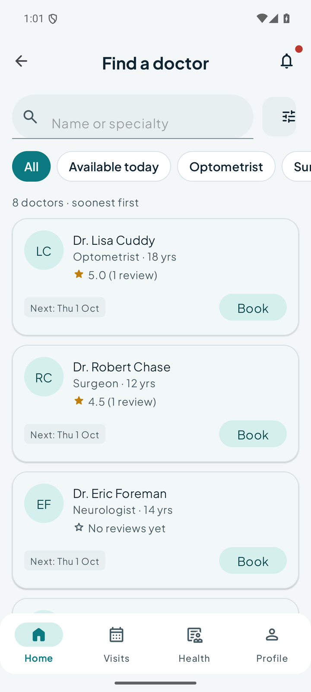<br><sub>Find a doctor</sub></td>
    <td align="center"><br><sub>Choosing a time</sub></td>
  </tr>
  <tr>
    <td align="center">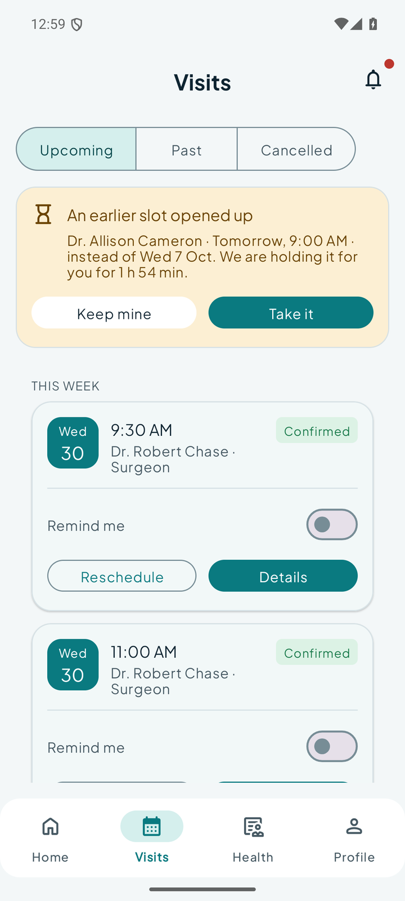<br><sub>Visits</sub></td>
    <td align="center"><br><sub>Your visit</sub></td>
    <td align="center">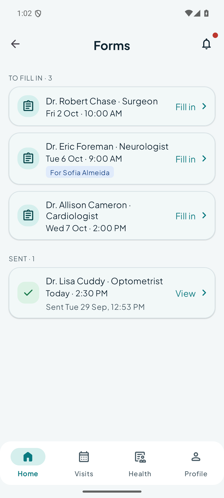<br><sub>Forms</sub></td>
  </tr>
  <tr>
    <td align="center">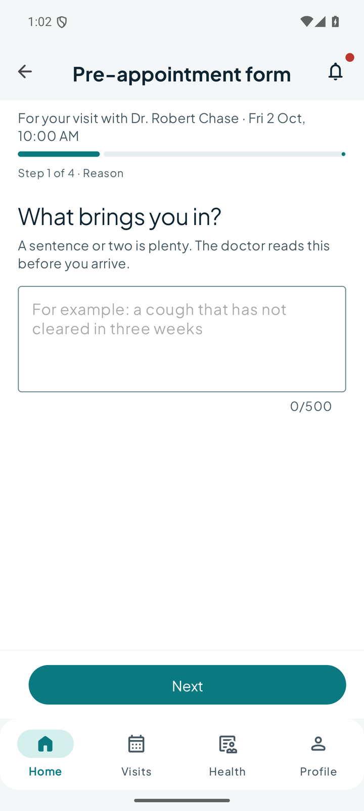<br><sub>Pre-appointment form</sub></td>
    <td align="center">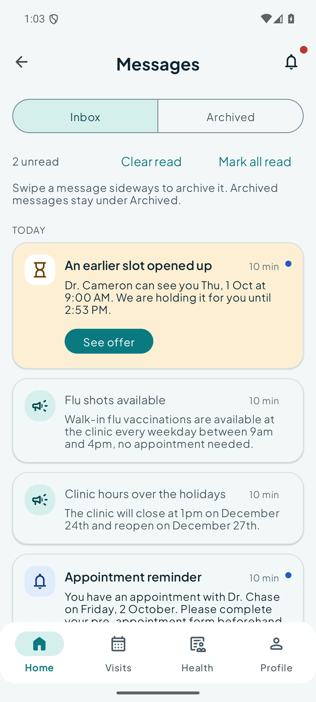<br><sub>Messages</sub></td>
    <td align="center">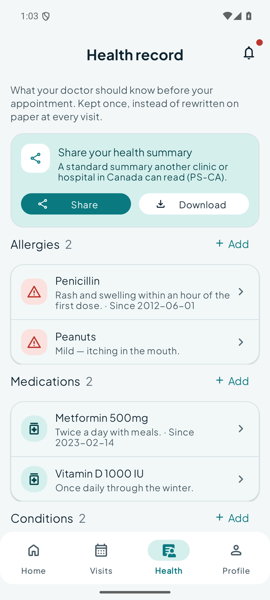<br><sub>Health record</sub></td>
  </tr>
  <tr>
    <td align="center">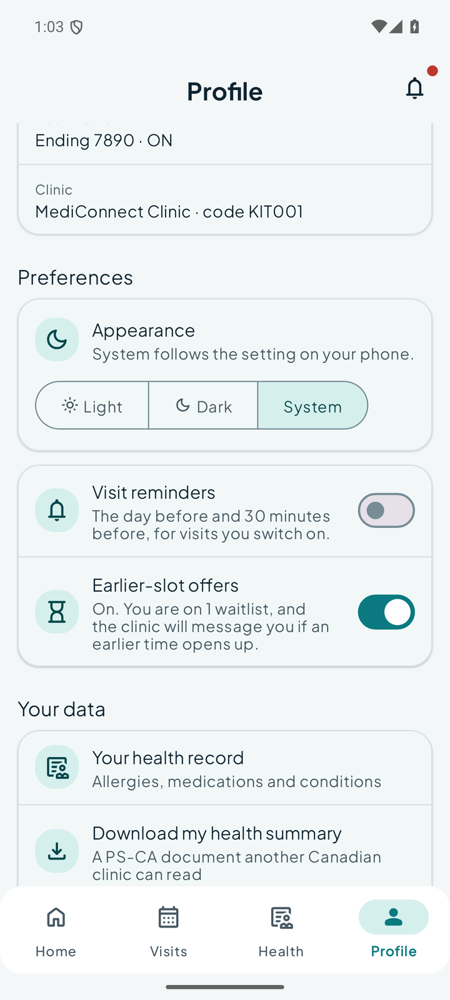<br><sub>Profile</sub></td>
  </tr>
</table>

<div align="center">
  <br>
  <strong>Dark mode</strong><br>
  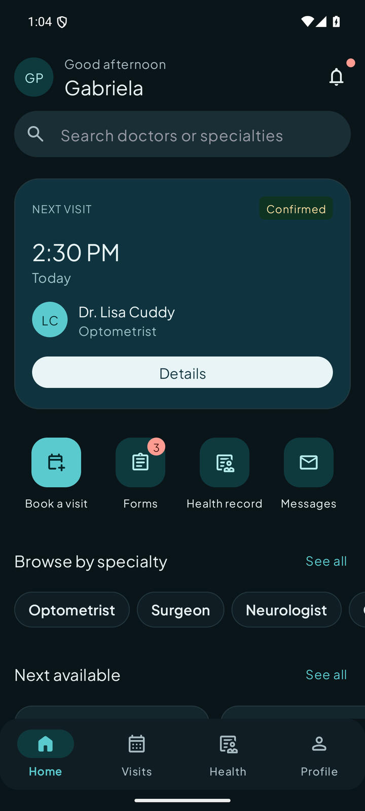
</div>

**Back office**

<table>
  <tr>
    <td align="center"><br><sub>Today</sub></td>
    <td align="center">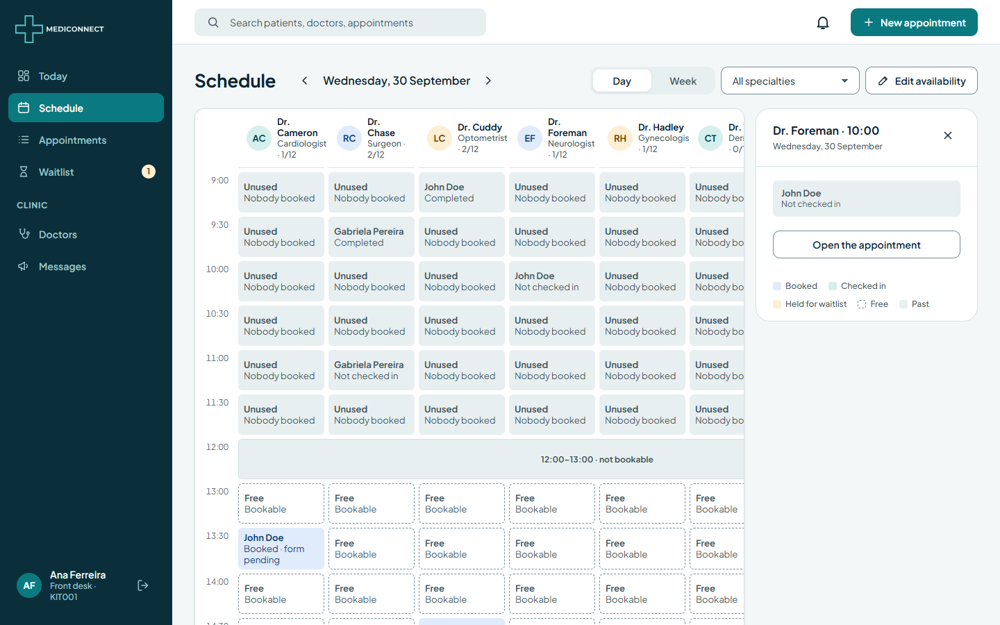<br><sub>Schedule, day</sub></td>
  </tr>
  <tr>
    <td align="center">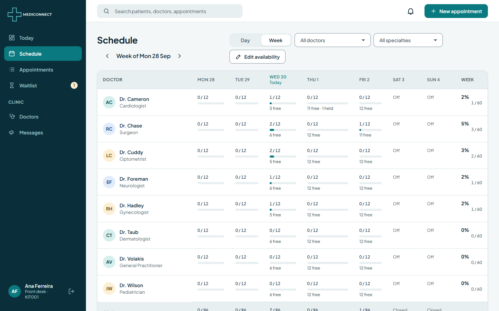<br><sub>Schedule, week</sub></td>
    <td align="center">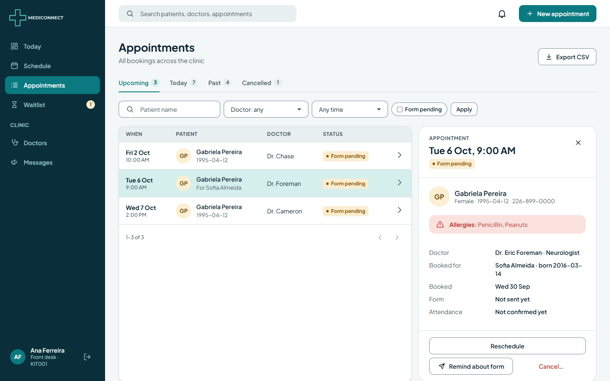<br><sub>Appointments</sub></td>
  </tr>
  <tr>
    <td align="center">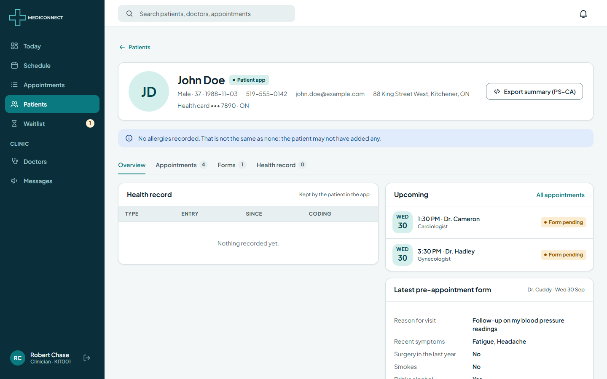<br><sub>Patient chart</sub></td>
    <td align="center">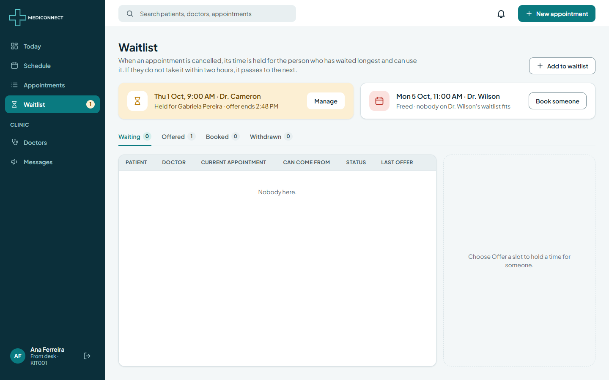<br><sub>Waitlist</sub></td>
  </tr>
  <tr>
    <td align="center">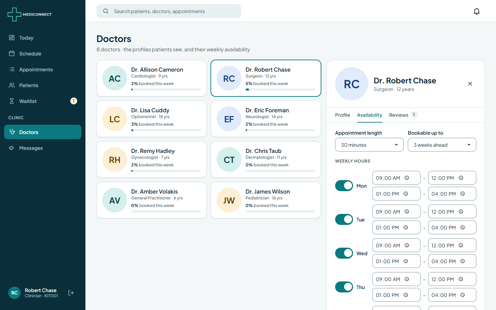<br><sub>A doctor's week</sub></td>
    <td align="center">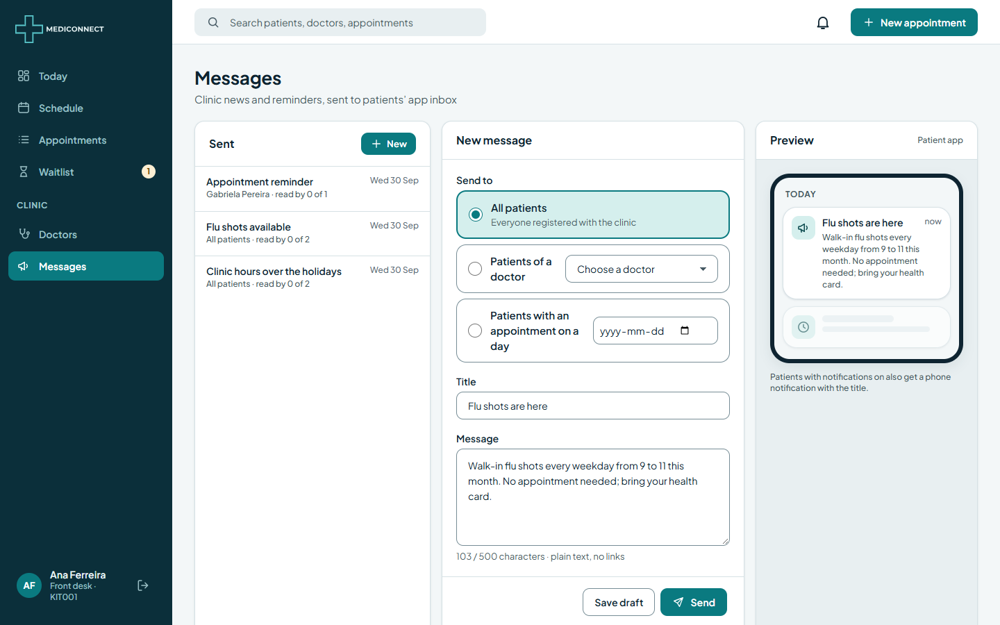<br><sub>Messages</sub></td>
  </tr>
  <tr>
    <td align="center">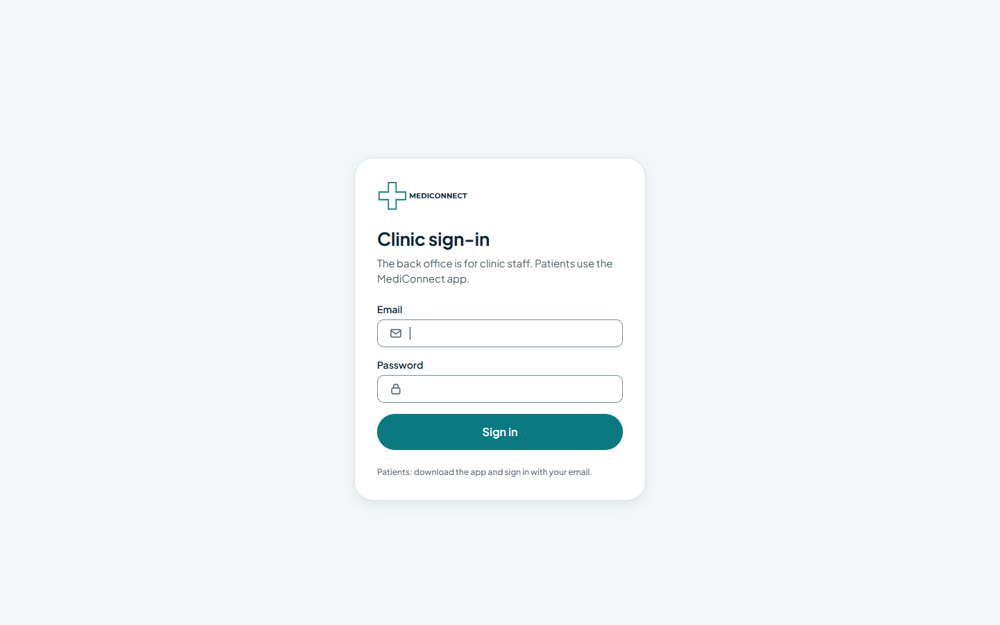<br><sub>Staff sign-in</sub></td>
  </tr>
</table>

## Tech stack

| | |
|---|---|
| **App** | Java (17 bytecode), Android SDK (min 26, target and compile 34), AGP 8.5.2, Material 3, ViewBinding, OkHttp, Gson, Glide, core library desugaring |
| **API** | Java 21, Spring Boot 3.3.5, Spring Data JPA, Bean Validation, Lombok, springdoc-openapi |
| **FHIR** | HAPI FHIR 7.4.5 (R4 structures and validator); CA Core+, CA Baseline and PS-CA profiles |
| **Back office** | Thymeleaf, htmx 2.0.3, a shared `mc-` design system, BCrypt from spring-security-crypto |
| **Database** | H2 in-memory by default, PostgreSQL 17 for real use |
| **Build** | Gradle wrappers (8.10.2 backend, 8.7 app), GitHub Actions on JDK 21 |

## Run it locally

**Requirements:** JDK 21 — the backend uses Java 21 APIs and does not compile on
17. Android Studio only if you want to run the app.

```bash
git clone https://github.com/gabrielapereira15/Mediconnect.git
cd Mediconnect
```

### 1. Start the backend

```bash
cd backend
./gradlew bootRun
```

That is the whole setup. It runs the `local` profile (templates are read from
disk, so edits show on refresh) on an **in-memory H2 database**, and seeds a
small clinic on first start:

- 8 doctors, each with a usual week, and weekday slot grids three weeks either
  side of today
- two patients: `demo@mediconnect.ca`, with visits in every state, one of them
  booked for a family member, and `john.doe@example.com`, who appears in
  today's clinic
- on weekdays, a clinic of 7 visits today, some checked in, some with forms in
- reviews, messages, form answers, a health record for the demo patient, and a
  waitlist entry holding an earlier slot for them
- two back-office logins

| What | Where |
|---|---|
| Clinic back office | http://localhost:8080 (redirects to `/staff/login`) |
| API docs (Swagger) | http://localhost:8080/swagger-ui.html — sign in to the back office first |
| Database console | http://localhost:8080/h2-console — JDBC URL `jdbc:h2:mem:mediconnect`, user `sa`, no password |

Check it is up:

```bash
curl http://localhost:8080/api/mobile/doctors
```

**Back-office logins** — password `demo` for both:

| Email | Role | Can |
|---|---|---|
| `desk@mediconnect.ca` (Ana Ferreira) | Front desk | Book, check in, cancel, reschedule, remind; run the waitlist; send messages; add and edit doctors and change any agenda |
| `doctor@mediconnect.ca` (Robert Chase) | Clinician | Open patient charts, which the front desk cannot; change Dr. Robert Chase's own usual week, days off and free slots |

Everything else can be viewed by both. The logins are created only when the
staff table is empty (set by `DEMO_STAFF_ACCOUNTS`).

<details>
<summary><strong>Using PostgreSQL instead</strong></summary>

The default H2 database is wiped on every restart. For one that persists, with
Docker running:

```bash
cd backend
./gradlew bootRun --args='--spring.profiles.active=postgres'
```

The `postgres` profile starts `backend/docker-compose.yml` (Postgres 17 on
:5432) through Spring Boot's Docker Compose support, so running
`docker compose up -d` first is optional. An empty database gets the demo
doctors and patients here too, but not the demo back-office logins, because
their password is public.

To use a Postgres you already have, switch the Compose support off, or it
starts its own container and connects to that:

```bash
JDBC_DATABASE_URL=jdbc:postgresql://localhost:5432/mediconnect \
JDBC_DATABASE_USERNAME=me JDBC_DATABASE_PASSWORD=secret \
./gradlew bootRun --args='--spring.profiles.active=postgres --spring.docker.compose.enabled=false'
```

Create the first back-office account from the environment:

```bash
STAFF_BOOTSTRAP_EMAIL=you@clinic.example \
STAFF_BOOTSTRAP_PASSWORD='<at least 12 characters>' \
STAFF_BOOTSTRAP_ROLE=FRONT_DESK \
./gradlew bootRun --args='--spring.profiles.active=postgres'
```

It is created on the first start where no account has that email, and left
alone after that: changing the variables later does not change its password.
Start with `FRONT_DESK` — only the front desk can add doctors, book or send
messages. There is no page for managing staff, so each further account is
another bootstrap with a new email.

For a clinician, also set `STAFF_BOOTSTRAP_DOCTOR_ID` to their doctor's id (the
`selected=` value in `/doctors?selected=…`, or `id` from
`GET /api/mobile/doctors`). The doctor has to exist already, and the link is
made only when the account is created. Without it a clinician can read charts
but not change any agenda.

</details>

### 2. Run the app

Open `android/` in Android Studio and press Run — it will create an emulator
if you have none, and write the `local.properties` it needs.

To build from the command line instead, tell Gradle where your Android SDK is:

```bash
cd android
echo "sdk.dir=/path/to/Android/Sdk" > local.properties   # macOS/Linux
# Windows: sdk.dir=C:/Users/you/AppData/Local/Android/Sdk

./gradlew assembleDebug
adb install -r app/build/outputs/apk/debug/app-debug.apk
```

`local.properties` is machine-specific and git-ignored, which is why it is not
in the repository.

The app points at `http://10.0.2.2:8080` — the emulator's route to your
machine's localhost. To use a different server:

```bash
./gradlew assembleDebug -PapiBaseUrl=https://api.example.com
```

The address is fixed into the build, so changing server means rebuilding.

**On a phone connected by USB**, forward the port and build against
`localhost`:

```bash
adb reverse tcp:8080 tcp:8080
./gradlew assembleDebug -PapiBaseUrl=http://localhost:8080
adb install -r app/build/outputs/apk/debug/app-debug.apk
```

Run `adb reverse` again whenever the phone is unplugged or restarted. A LAN
address over plain HTTP (`http://192.168.x.x:8080`) will not work: debug builds
allow cleartext only to `10.0.2.2`, `localhost` and `127.0.0.1`.

> **Without the backend running**, a fresh install cannot get past sign-in
> ("Could not reach the clinic server"). A patient who signed in earlier sees a
> bundled demo clinic — doctors, visits, messages and health entries — with a
> banner saying so. Booking, forms, the waitlist and the summary download need
> the server.

### 3. Sign in

Sign-in is by one-time passcode. The app says it has emailed a 6-digit code,
but there is no mail provider wired up: in development the passcode is
**printed to the backend log** (the API returns it too, but the app does not
show it):

```
Passcode for demo@mediconnect.ca is 418223 (valid 10 minutes)
```

The code is checked as soon as all six digits are in. **Resend** unlocks after
30 seconds.

Use the seeded patient — **`demo@mediconnect.ca`** — which already has visits,
forms, messages, a health record and a waitlist entry. Any other email creates
a fresh patient: the app opens on Edit profile, and every tab stays locked
until first name, last name, date of birth and phone are filled in.

> The production profile turns this off, so a real deployment never exposes a
> passcode.

### What to try

In the app, signed in as `demo@mediconnect.ca`:

- **Home** — the next visit, quick actions (Forms shows how many are still to
  fill in), specialties, and the doctors available today
- **Book a visit** — Find a doctor (search, specialty chips, Filters), pick a
  day and a time, review, then "You are booked". Times under 6 hours away are
  not offered, and a doctor can be booked only within their horizon (3 weeks by
  default). A full day stays tappable and offers the waitlist instead
- **Visits** — Upcoming (This week / Later), Past (Book again, Leave a review —
  then see the doctor's rating change) and Cancelled (Re-book). **Pull down** to
  re-fetch
- **Your visit** — tap a visit: check in (on the day only), confirm you will be
  there, the form, directions, "Tell me if something earlier opens up",
  reschedule and cancel. Rescheduling cancels the visit first, so its slot is
  released even if you do not pick a new time
- **An earlier slot** — when one is held for you, a banner at the top of Visits
  offers **Take it** or **Keep mine**
- **Forms** — the four-step pre-appointment form keeps a draft; sent answers
  can be read back and edited
- **Messages** — the bell on Home: Mark all read, swipe to archive (with Undo),
  Clear read, and the Archived view
- **Health** — add an allergy, medication or condition; **Stop** marks one no
  longer current. From the summary: share it as text, download the PS-CA FHIR
  JSON, or export it for a clinic
- **Visit reminders** — Remind me on an upcoming visit. If the phone has not
  allowed exact alarms, the first one opens that setting
- **Profile** — edit details (the email is read-only; a health card needs its
  province), Appearance (System, Light or Dark — System follows the device),
  the reminder default and the earlier-slot offers switch
- **Offline** — stop the backend and reopen the app: the demo clinic appears
  under a banner, rather than empty screens

In the back office at http://localhost:8080:

- As **`desk@mediconnect.ca`** — check someone in on Today; cancel or move one
  of the demo patient's visits and see the message it sends to the app; send
  or schedule a message from Messages
- As **`doctor@mediconnect.ca`** — open a patient chart and download its PS-CA
  summary; change Dr. Chase's usual week or add a day off

### Commands

| Directory | Command | Does |
|---|---|---|
| `backend` | `./gradlew bootRun` | Start the API and back office |
| `backend` | `./gradlew build` | Compile and run the tests |
| `backend` | `./gradlew test` | Tests only |
| `android` | `./gradlew assembleDebug` | Build the APK |
| `android` | `./gradlew testDebugUnitTest` | Unit tests |
| `android` | `./gradlew lintDebug` | Android lint |

### Configuration

| Variable | Default | Purpose |
|---|---|---|
| `SPRING_PROFILES_ACTIVE` | `local` under `bootRun` | `postgres` for a real database, `production` to deploy |
| `JDBC_DATABASE_URL` | in-memory H2; `jdbc:postgresql://localhost:5432/mediconnect` with `postgres` | Database connection. **Required** in production |
| `JDBC_DATABASE_USERNAME`, `JDBC_DATABASE_PASSWORD` | `sa` / empty; the `backend/docker-compose.yml` login with `postgres` | Database login. **Required** in production |
| `TOKEN_SECRET` | dev value | Token signing key — **required** in production. The fixed dev value keeps tokens valid across restarts |
| `TOKEN_TTL_HOURS` | `72` | How long a sign-in lasts |
| `OTP_TTL_MINUTES` | `10` | How long a passcode lasts |
| `EXPOSE_OTP` | `true` | Return the passcode in the response and log it |
| `DEMO_DATA_ENABLED` | `true` | Seed a database that has no doctors. Still on with `postgres` |
| `DEMO_STAFF_ACCOUNTS` | `true` | Create the demo back-office logins into an empty staff table. Always off with the `postgres` and `production` profiles |
| `STAFF_BOOTSTRAP_EMAIL`, `STAFF_BOOTSTRAP_PASSWORD` | none | First back-office account, created at startup if missing. The password must be at least 12 characters. Being created first, it also stops the demo logins |
| `STAFF_BOOTSTRAP_NAME`, `STAFF_BOOTSTRAP_ROLE` | email, `FRONT_DESK` | Its display name and role (`FRONT_DESK` or `CLINICIAN`) |
| `STAFF_BOOTSTRAP_DOCTOR_ID` | none | Links a `CLINICIAN` bootstrap account to a doctor, so they can change that doctor's agenda |
| `PHOTO_BASEURL` | `http://localhost:8080` | Where doctor photos are served from |
| `FHIR_BASE_URL` | `http://localhost:8080/fhir` | The address FHIR resources are published under; used in every Bundle `fullUrl` |
| `CLINIC_NAME` | `Mediconnect Clinic` | The clinic's name as a FHIR Organization |

The `production` profile turns off demo data, the demo logins, `EXPOSE_OTP`
and the H2 console.

### Troubleshooting

| Symptom | Fix |
|---|---|
| App shows demo data with the server running | The emulator reaches your machine at `10.0.2.2`, not `localhost`. Rebuild with the right `-PapiBaseUrl` if you changed it. |
| Phone shows demo data or cannot reach the server | Re-run `adb reverse tcp:8080 tcp:8080`, and build with `-PapiBaseUrl=http://localhost:8080`. |
| `CLEARTEXT communication not permitted` | Only debug builds allow plain HTTP, and only to `10.0.2.2`, `localhost` and `127.0.0.1` — not a LAN IP. Use a debug build with `adb reverse`, or serve over HTTPS. |
| 401 from the API | The token expired (72 hours by default) or `TOKEN_SECRET` changed. Sign in again. |
| 404 on the profile or messages after restarting the backend | H2 was wiped and only the seeded patients came back. Sign out and in again to recreate the account, or use Postgres. |
| Swagger redirects to `/staff/login` | The API docs sit behind the back-office sign-in. Sign in first. |
| 403 on Patients in the back office | Only clinicians can open charts. Sign in as `doctor@mediconnect.ca`. |
| Doctor photo upload fails for a file over 1 MB | Spring's default multipart limit (1 MB) applies before the app's own 2 MB check. Use a smaller JPEG, PNG or WebP. |
| Backend fails to compile with `cannot find symbol … getFirst()` | You are on JDK 17. Use JDK 21. |
| `Could not resolve placeholder 'TOKEN_SECRET'` | You started the `production` profile without setting it. That is deliberate. |
| Nobody can sign in to the back office on Postgres or in production | Set `STAFF_BOOTSTRAP_EMAIL` and `STAFF_BOOTSTRAP_PASSWORD` and restart. The startup log warns when there are no staff accounts, and says why an account was not created. |
| `SDK location not found` when building from the terminal | Create `android/local.properties` with `sdk.dir=...`, as above. |
| App says the server is unreachable, but `curl` works from your machine | The emulator's own network can get stuck, usually after throttling it. Check with `adb shell ping 10.0.2.2`; if that fails, cold-boot the emulator (**Wipe Data** in Device Manager). |

## Tests

```bash
cd backend && ./gradlew test                # 193 tests, *IT integration tests included
cd android && ./gradlew testDebugUnitTest   # 57 tests
```

The backend tests cover:

- sign-in: whether a passcode can be guessed (replay, brute-force burnout,
  expiry) and whether a token can be forged (wrong secret, tampered payload,
  signature swapped from another account)
- path ownership: a token cannot reach another patient's records through an
  email in the URL
- back-office access by role, the staff bootstrap and the demo logins
- FHIR conformance, and validation against CA Core+, CA Baseline and PS-CA,
  run offline against IG packages kept in the repository
- waitlist holds and the offers switch, check-in, message archiving, the
  clinic's visit messages, the patient profile and health card
- the Today, Schedule and Appointments views and a doctor's weekly hours

The app tests cover visit reminders, form sections, health-card input, unread
counts, the Visits segments, waitlist entries, the demo catalogue and the
patient model.

**CI** (`.github/workflows/ci.yml`) runs on JDK 21 for pushes to `main`,
`master`, `v2` and `revamp/**` and for pull requests: the backend build and
tests, and in a parallel job the app's unit tests, `lintDebug` and
`assembleDebug`. The debug APK is kept as a download for 14 days after each
successful run.

## API reference

Base URL `http://localhost:8080`. Request and response shapes for
`/api/mobile/**` are in Swagger at `/swagger-ui.html`, once you are signed in
to the back office; `/auth` and `/fhir` are not in it.

### Auth

| Method | Route | Description |
|---|---|---|
| `POST` | `/auth/get-otp` | Issue a passcode for an email |
| `POST` | `/auth/verify-otp` | Exchange a passcode for a bearer token |

```bash
curl -X POST http://localhost:8080/auth/get-otp \
  -H "Content-Type: application/json" \
  -d '{"email":"demo@mediconnect.ca","role":"patient"}'
```

`get-otp` answers `{message, otp, expiresInMinutes}`, with `otp` only while
`EXPOSE_OTP` is on. A new request replaces any pending code, and a code is
thrown away after 5 wrong tries. `verify-otp` takes `{email, otp}` and returns
`{token, email, expiresInSeconds, newPatient}`; a first sign-in creates an
empty patient record. The token is an HMAC-SHA256 `payload.signature`, not a
JWT, and lasts 72 hours. A wrong, expired or used-up code is a 401 with one
generic message.

### Mobile

The doctor directory and photos are public. Everything else needs
`Authorization: Bearer <token>`.

| Method | Route | Auth | What |
|---|---|---|---|
| `GET` | `/api/mobile/doctors` | public | The directory |
| `GET` | `/api/mobile/doctors/{id}` | public | One doctor |
| `GET` | `/api/mobile/doctors/photo/{id}` | public | Photo bytes — `` tags cannot send a header |
| `GET` | `/api/mobile/patients/{email}` | required | Profile |
| `POST` | `/api/mobile/patients` | required | Create or update your own profile (the body's email must be the token's) |
| `PUT` | `/api/mobile/patients/{id}` | required | Update your own profile; the sign-in email is not changed |
| `GET` | `/api/mobile/appointments/{email}` | required | The patient's visits |
| `POST` | `/api/mobile/appointments` | required | Book a free slot at least 6 hours ahead, for the signed-in patient |
| `PUT` | `/api/mobile/appointments/cancel/{id}` | required | Cancel |
| `PUT` | `/api/mobile/appointments/{id}/checkin` | required | Check in, on the day of the visit only |
| `PUT` | `/api/mobile/appointments/{id}/attendance` | required | Confirm attendance, before the visit starts |
| `GET` | `/api/mobile/appointments/{id}/form` | required | Pre-visit form answers; 204 if none sent |
| `PUT` | `/api/mobile/appointments/{id}/form` | required | Send the form, or replace the earlier answers |
| `GET` | `/api/mobile/notifications/{email}` | required | Messages, read and archived included |
| `POST` | `/api/mobile/notifications/ack/{id}` | required | Mark one read |
| `POST` | `/api/mobile/notifications/read-all/{email}` | required | Mark all read |
| `POST` | `/api/mobile/notifications/archive/{id}` | required | Archive one (and mark it read) |
| `POST` | `/api/mobile/notifications/unarchive/{id}` | required | Move one back to the inbox |
| `POST` | `/api/mobile/notifications/archive-read/{email}` | required | Archive every read message; returns their ids, for Undo |
| `POST` | `/api/mobile/reviews` | required | Review one of your visits once it has happened: once, 1–5 stars |
| `GET` | `/api/mobile/health/{email}` | required | Health record |
| `POST` | `/api/mobile/health/{email}` | required | Add an allergy, medication or condition |
| `POST` | `/api/mobile/health/{email}/{id}/stop` | required | Mark an entry no longer current |
| `GET` | `/api/mobile/waitlist/{email}` | required | The patient's waitlist entries |
| `POST` | `/api/mobile/waitlist/{email}` | required | Join a doctor's waitlist |
| `POST` | `/api/mobile/waitlist/{email}/{id}/accept` | required | Take the held slot; the visit it replaces is released |
| `POST` | `/api/mobile/waitlist/{email}/{id}/decline` | required | Keep the current visit; the slot moves on |
| `POST` | `/api/mobile/waitlist/{email}/{id}/leave` | required | Leave the waitlist |
| `GET`, `PUT` | `/api/mobile/waitlist/{email}/offers` | required | Earlier-slot offers on or off, `{"on": true}` |

In `ack`, `archive` and `unarchive`, `{id}` is the delivery id from the
`GET /notifications/{email}` list, not the message's own id.

#### Ownership and errors

- No token, or an invalid one: **401**, "Sign in to continue."
- An email in the path, or in the body of `POST /appointments` or
  `POST /patients`, that is not the token's own: **403**.
- A record addressed by id that belongs to someone else — a visit, its form, a
  review's visit, a profile, a message, a waitlist entry, a health entry:
  **404**, so ids cannot be probed.
- **409** when a slot was just taken or is under 6 hours away, check-in is not
  open, an offer has ended, the patient is already on that waitlist, or a
  visit cannot be reviewed (not happened yet, cancelled, or already reviewed).
- **400** for a health card without a province, or a review score outside 1–5.

### FHIR

A read-only view of the same data, shaped by HL7 FHIR R4 rather than by the
app's screens, so another Canadian system can read it. Patient,
Practitioner, PractitionerRole, Organization and Appointment carry **CA
Core+** profiles (and CA Baseline where it also applies); `$summary`
returns a pan-Canadian Patient Summary (**PS-CA**) document. Responses are
`application/fhir+json`.

| Method | Route | Auth |
|---|---|---|
| `GET` | `/fhir/metadata` | public |
| `GET` | `/fhir/Practitioner`, `/fhir/Practitioner/{id}`, `/fhir/PractitionerRole` | public |
| `GET` | `/fhir/Organization/mediconnect` | public |
| `GET` | `/fhir/Schedule`, `/fhir/Slot` (`?status=free` or `busy`, optional) | public |
| `GET` | `/fhir/Patient/{id}` | required, own record only |
| `GET` | `/fhir/Patient/{id}/$summary` | required, own record only |
| `GET` | `/fhir/Appointment?patient={id}` | required, own record only |

What is verified and what is not — including why scheduling claims no
Canadian profile — is in **[docs/FHIR.md](docs/FHIR.md)**.

## Architecture

```
android/
└─ app/src/main/java/…/mediconnect_android/
   ├─ activity/     Splash, Welcome, SignIn, OTP, Main
   ├─ fragment/     one per screen
   ├─ adapter/      RecyclerView adapters
   ├─ client/       API clients — ApiConfig holds the base URL and token
   ├─ data/         bundled demo clinic, used when the API is unreachable
   ├─ model/        response models
   ├─ view/         StateView: loading skeleton, empty and error states
   └─ util/         Background (threading), SessionManager, visit reminders,
                    theme, unread count, dialogs

backend/src/main/java/com/vegs/mediconnect/
├─ auth/            OTP issue/verify, HMAC tokens, the patient token interceptor
├─ mobile/          the REST API the app consumes
├─ fhir/            FHIR R4 facade and PS-CA summary, on HAPI FHIR structures
├─ backoffice/      the clinic back office (Thymeleaf + htmx)
│  ├─ auth/         staff sign-in, roles and the staff interceptor
│  └─ today/, schedule/, appointment/, patient/, waitlist/, doctor/, message/
├─ datasource/      JPA entities and repositories
├─ demo/            seeds an empty database
└─ config/          JPA, Jackson, Swagger, template reloading for `local`
```

**A few decisions worth noting**

- **Two interceptors, no Spring Security filter chain.** The patient side and
  the back office are secured differently, and a filter chain for one would
  have changed the other as a side effect. One interceptor checks the bearer
  token on the mobile routes and `/fhir`, and that any email in the path is the
  token's own — a token proves who you are, it must not let you read someone
  else; records addressed by id are checked in the services (four routes are
  not yet — see [Known gaps](#known-gaps)). The other puts a
  session sign-in and role checks in front of everything else. Staff passwords
  are hashed with BCrypt from `spring-security-crypto` alone.
- **A freed slot goes to one patient at a time.** It is held for the patient
  who has waited longest and can use it, for up to 2 hours (never past the
  6-hour booking cutoff). A decline, leaving the list, or the hold lapsing —
  checked every minute — passes it to the next person, or back on sale.
  Offering it to everyone at once meant the fastest thumb won. There is no
  push service, so the offer waits in the app until it is opened, which is why
  the hold is hours rather than minutes.
- **The app never blocks the UI thread.** Every client call goes through
  `Background`, which is why a slow or missing server degrades instead of
  freezing the app.
- **Colours are named by role, not appearance.** `md_on_surface`, not
  `dark_gray`. That is what makes a dark palette expressible; the old names are
  kept as aliases so existing layouts pick up both themes unchanged.
- **H2 by default, Postgres by profile.** A clone should run with one command
  and no database install.

## Known gaps

- No email, SMS or push. Passcodes are only logged, and clinic messages and
  offers are seen when the app is opened. Visit reminders are local
  notifications set on the phone.
- Scheduled messages use the server's time zone, so the server has to run in
  the clinic's.
- `backend/Dockerfile` still builds on JDK 17 with Gradle 7.5 and cannot build
  this code. It is unmaintained.
- `backend/README.md` is left over from the original scaffold and out of date
  (it mentions Bootstrap and a Docker Compose start on every run). Follow this
  file instead.

## Credits

Originally built for the Mobile Solutions postgraduate
program at Conestoga College, then rebuilt as a portfolio piece.

Typeface: [Plus Jakarta Sans](https://fonts.google.com/specimen/Plus+Jakarta+Sans),
under the SIL Open Font License 1.1 (see
`android/app/licenses/PlusJakartaSans-OFL.txt`). One older app style still uses
[Montserrat](https://fonts.google.com/specimen/Montserrat). Both from Google
Fonts.

## Licence

[MIT](LICENSE) © Gabriela Nascimento Oliveira Pereira
