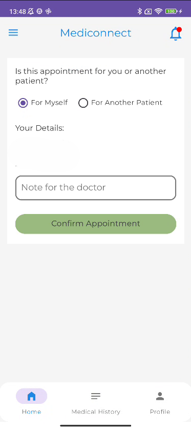
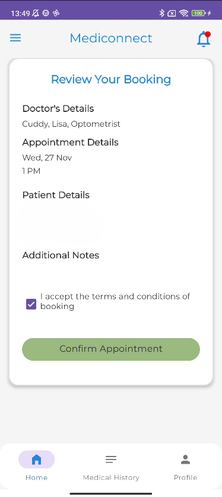

# MediConnect

Welcome to **MediConnect**, a comprehensive patient management app designed to enhance the efficiency of healthcare clinics in Canada. This app simplifies appointment scheduling, medical history access, and more, creating a seamless experience for both patients and healthcare providers.

---

## Features

MediConnect offers the following features:

- **Appointment Scheduling**: Book in-person or online consultations.
- **Medical History Access**: View detailed patient records and diagnoses.
- **Wearable Device Integration**: Sync smartwatch data like heart rate and blood pressure for remote monitoring.
- **Pre-Appointment Forms**: Patients can fill out forms prior to consultations.
- **Medication Reminders**: Notify patients about their medication schedules.
- **Virtual Check-ins and Triage**: Streamline patient flow with online check-ins.
- **Payment Integration**: Manage billing and payments securely.

---

## Purpose

MediConnect aims to:

- Improve clinic operations by reducing manual tasks.
- Enhance patient satisfaction with a user-friendly interface.
- Enable better decision-making through integrated health data.

---

## Technologies Used

- **Programming Language**: Java
- **Framework**: Android SDK
- **Database**: MongoDB and Postgres
- **Cloud Services**: Render
- **UI Design**: Material Design principles

---

## Getting Started

1. Clone the repository to your local machine.
2. Open the project in Android Studio.
3. Configure the necessary API keys and database settings.
4. Build and run the app on an emulator or physical device.

---

## Screenshots

---

## Future Enhancements

- Implement missing features:
    - **Medical History Access**: View detailed patient records and diagnoses.
    - **Wearable Device Integration**: Sync smartwatch data like heart rate and blood pressure for remote monitoring.
    - **Medication Reminders**: Notify patients about their medication schedules.
    - **Payment Integration**: Manage billing and payments securely.
- Add multilingual support for broader accessibility.
- Introduce AI-powered health insights and recommendations.
- Enable telemedicine features for virtual consultations.
- Expand smartwatch compatibility.

---

## Contributing

We welcome contributions! If you’d like to improve MediConnect, please fork the repository, make your changes, and submit a pull request.

---
